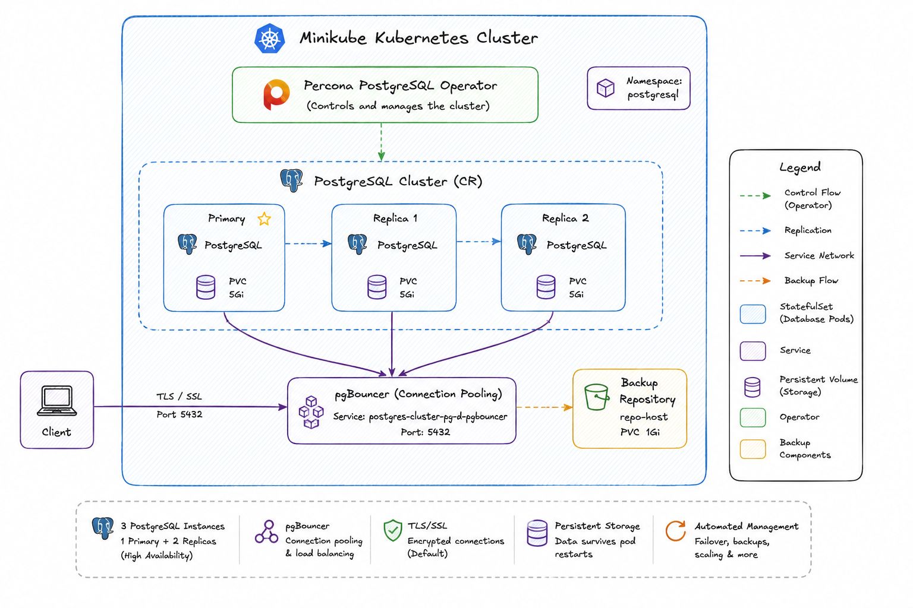
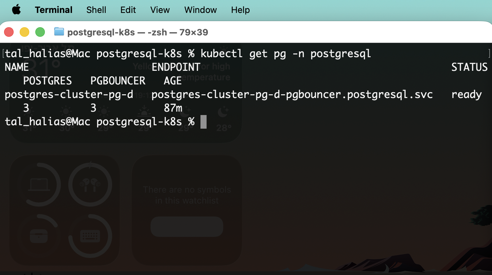
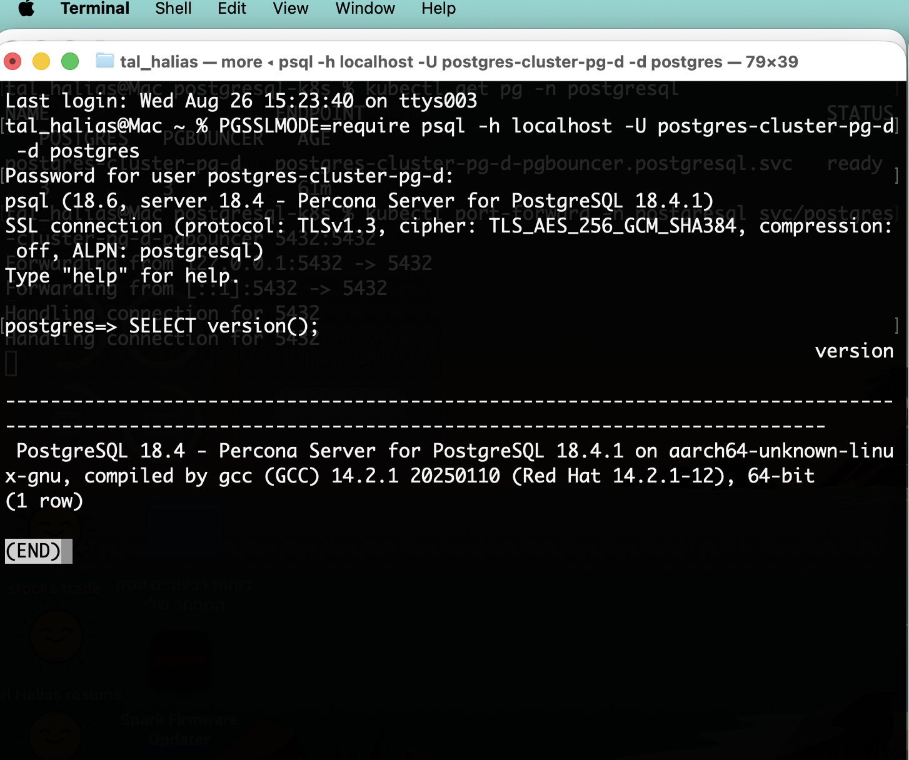

# PostgreSQL-K8s

## Introduction

This repository contains the implementation of a home assignment for deploying PostgreSQL on a local Kubernetes environment using the Percona PostgreSQL Operator.

The goal was to deploy a functional PostgreSQL cluster, verify database connectivity, and document the deployment process and implementation decisions.

**The implementation intentionally keeps the solution simple and relies on the official Percona Helm charts, reflecting the scope of the assignment.**

## Table of Contents

1. [Overview](#overview)
2. [Prerequisites](#prerequisites)
3. [Minikube Installation](#minikube-installation)
4. [Architecture](#architecture)
5. [Deployment](#deployment)
6. [Verification](#verification)
7. [Design Decisions](#design-decisions)
8. [Limitations](#limitations)
9. [Production Considerations](#production-considerations)
10. [Resources Used](#resources-used)
11. [Summary](#summary)

## Overview

This project demonstrates a PostgreSQL cluster running on a local Kubernetes environment and managed by the **Percona PostgreSQL Operator**.

**Tested with:**
- Kubernetes v1.30
- Minikube v1.34
- Helm v3
- PostgreSQL 18.4

## Prerequisites

Required tools:

- **kubectl**
- **Helm 3**
- **Minikube**
- A supported Minikube driver
- **psql** for connectivity testing

Verify the required tools:

```bash
kubectl version
helm version
minikube version
```

## Minikube Installation

```bash
minikube start \
  --cpus=4 \
  --memory=6144 \
  --disk-size=20g \
  --kubernetes-version=v1.30.0
```

Verify:

```bash
minikube status
kubectl get nodes
```

## Architecture



The deployment includes:

- **Percona PostgreSQL Operator** for cluster lifecycle management
- **3 PostgreSQL instances** managed by the Operator
- **pgBouncer** for connection pooling
- **Persistent Volumes** for database storage
- **Backup repository** managed by the Percona Operator
- **Kubernetes Services** for internal database access
- **TLS/SSL connectivity** provided by the default Percona configuration

> **Note:** All workloads run on a single Minikube node. Multiple PostgreSQL instances provide logical redundancy, but not infrastructure-level high availability.

## Deployment

### 1. Add the Percona Helm Repository

```bash
helm repo add percona https://percona.github.io/percona-helm-charts/
helm repo update
```

### 2. Create the PostgreSQL Namespace

```bash
kubectl create namespace postgresql
```

### 3. Install the Percona PostgreSQL Operator

```bash
helm install pg-operator percona/pg-operator -n postgresql
```

Verify:

```bash
kubectl get pods -n postgresql
kubectl get deployments -n postgresql
kubectl get crds | grep -i percona
```

### 4. Deploy the PostgreSQL Cluster

```bash
helm install postgres-cluster percona/pg-db -n postgresql
```

```bash
kubectl get pods -n postgresql -w
```

### 5. Verify Kubernetes Resources

```bash
kubectl get pods -n postgresql
kubectl get svc -n postgresql
kubectl get pvc -n postgresql
```

## Verification

### Cluster Status

```bash
kubectl get pg -n postgresql
```



### Retrieve Credentials

```bash
kubectl get secret postgres-cluster-pg-d-pguser-postgres-cluster-pg-d -n postgresql -o jsonpath='{.data.user}' | base64 -d
kubectl get secret postgres-cluster-pg-d-pguser-postgres-cluster-pg-d -n postgresql -o jsonpath='{.data.password}' | base64 -d
```

### Port Forward

```bash
kubectl port-forward -n postgresql svc/postgres-cluster-pg-d-pgbouncer 5432:5432
```

### Connect

```bash
PGSSLMODE=require psql -h localhost -U postgres-cluster-pg-d -d postgres
```

### Test Query

```sql
SELECT version();
```



The successful connection confirms:

- PostgreSQL is reachable
- Authentication succeeds
- SQL queries execute successfully
- TLS/SSL connectivity is active

## Design Decisions

**Minikube** – A lightweight local Kubernetes environment suitable for the assignment.

**Helm** – The official Percona Helm charts were used to keep the deployment simple, reproducible and aligned with the supported installation method.

**Dedicated Namespace** – PostgreSQL resources are isolated in a dedicated `postgresql` namespace.

**Default Helm Values** – The deployment intentionally uses the official chart defaults. No custom `values.yaml` was required.

**Scope** – The implementation intentionally focuses on the scope of the assignment. Additional tooling such as Terraform, GitOps, or CI/CD would be considered in a larger production environment.

## Limitations

- Single-node Minikube environment
- No node-level fault tolerance
- No external backup storage
- Default Helm configuration
- No production resource tuning
- No monitoring or NetworkPolicies

## Production Considerations

If this deployment were intended for a production environment rather than a home assignment, I would consider the following improvements:

- Deploy the cluster on a multi-node Kubernetes environment.
- Use a custom `values.yaml` for explicit resource sizing and configuration.
- Configure external object storage (S3-compatible) for backups.
- Add monitoring and alerting with Prometheus and Grafana.
- Define NetworkPolicies to restrict traffic between workloads.
- Configure resource requests and limits for all components.
- Store credentials using an external secrets manager rather than relying only on Kubernetes Secrets.
- Enable encryption at rest and manage encryption keys securely.
- Apply least-privilege access for both PostgreSQL users and Kubernetes RBAC.
- Automate deployment using GitOps or CI/CD workflows.

The goal of this assignment was to demonstrate a clean and reproducible deployment rather than a production-ready database platform. The items above represent the next steps I would prioritize before deploying this architecture in production.

## Resources Used

- Official Percona Helm Charts: https://github.com/percona/percona-helm-charts
- Official Percona PostgreSQL Operator Documentation: https://docs.percona.com/percona-operator-for-postgresql/

No custom PostgreSQL manifests or custom Helm values were used in this implementation.

## Summary

This project demonstrates a functional PostgreSQL cluster managed by the Percona PostgreSQL Operator on a local Kubernetes environment.

The environment was successfully deployed, the cluster reached a `ready` state, and database connectivity was verified with a real SQL query over TLS.
